  

 

  

  
  
  
  

 

##  About Me

I'm a **just a kid** from **Jaipur, India** , who perhaps know some stuff and dont know alot of stuff (always open to learning)

-  **1st Place — LeafLine** at NSUT avinya'26 (2024)

 

## Recent PRs & Activity

  

  

##  Tech Stack

  

 

##  Let's Connect

  
  
  
  

