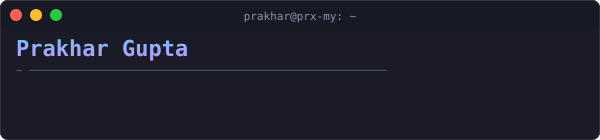

  

 

  

  
  
  
  
  

 

##  About Me

I'm a **just a kid** from **Jaipur, India** , who perhaps know some stuff and dont know alot of stuff (always open to learning)

-  **1st Place - LeafLine** at NSUT avinya'26 

 

## Things I've Built

Real tools, shipped and used. The hard parts aren't CRUD.

| Project | The hard part | Stack |
|---|---|---|
| **[nptel-quiz](https://github.com/prx-my/nptel-quiz)** | Solves image-based NPTEL quizzes by OCR'ing the question images **on-device** (Apple Vision compiled via `swiftc` on macOS, `Windows.Media.Ocr` on Windows), then answers through an AI agent or Gemini. Reuses the login session via Playwright and ships an installable agent skill. | `Node` · `Playwright` · `Swift` |
| **[oracle-academy](https://github.com/prx-my/oracle-academy)** | Drives Oracle's APEX Student Hub from the terminal. Keeps one signed-in browser alive over CDP, imports cookies from your default browser (DPAPI + App-Bound-Encryption handling), and falls back to Docker + noVNC because Oracle blocks headless Chromium. | `Node` · `Playwright` · `Docker` |

 

## Recent PRs & Activity

  

  

## Open Source Contributions

Merged work in real projects: reviewed, tested, and shipped upstream.

  
  &nbsp;
  

 

### Sugar Labs · [musicblocks-v4](https://github.com/sugarlabs/musicblocks-v4)
Blocks-based music programming environment · TypeScript · React · Zustand

| PR | Change | Area |
|:--:|---|---|
| [#942](https://github.com/sugarlabs/musicblocks-v4/pull/942) | Share the drag trailing-click suppression guard across three call sites | `refactor` · `masonry` |
| [#919](https://github.com/sugarlabs/musicblocks-v4/pull/919) | Clear and toggle brick selection on press | `fix` · `masonry` |
| [#871](https://github.com/sugarlabs/musicblocks-v4/pull/871) | Separate drag and click selection so drags stop leaving bricks selected | `fix` · `masonry` |
| [#850](https://github.com/sugarlabs/musicblocks-v4/pull/850) | Duplicate a brick and its subtree as an independent tower | `feat` · `masonry` |
| [#646](https://github.com/sugarlabs/musicblocks-v4/pull/646) | Correct tail step width bleed for `strokeWidth > 2` | `fix` · `geometry` |

 

### OWASP · [cve-lite-cli](https://github.com/OWASP/cve-lite-cli)
Dependency CVE scanner &amp; override-hygiene CLI · TypeScript · Node.js

| PR | Change | Area |
|:--:|---|---|
| [#1231](https://github.com/OWASP/cve-lite-cli/pull/1231) | Disclose compact-mode finding and command-group truncation | `fix` · `output` |
| [#1230](https://github.com/OWASP/cve-lite-cli/pull/1230) | Extract CLI flag literals into named constants | `refactor` · `cli` |
| [#1229](https://github.com/OWASP/cve-lite-cli/pull/1229) | De-duplicate flag-conflict error messages | `refactor` · `cli` |
| [#1228](https://github.com/OWASP/cve-lite-cli/pull/1228) | Add braces to remaining single-line `if` statements | `style` · `cli` |
| [#1202](https://github.com/OWASP/cve-lite-cli/pull/1202) | Surface the 5000-file scan cap so `--only-used` can't drop findings | `fix` · `security` |
| [#1200](https://github.com/OWASP/cve-lite-cli/pull/1200) | Document the OA010 override-hygiene rule | `docs` · `rules` |
| [#1183](https://github.com/OWASP/cve-lite-cli/pull/1183) | Apply the `0.x` caret rule in `satisfiesRange` | `fix` · `semver` |
| [#1181](https://github.com/OWASP/cve-lite-cli/pull/1181) | Correct OA008 pluralization and order copies by version | `fix` · `overrides` |

 

##  Tech Stack

  

 

##  Let's Connect

  
  
  
  

